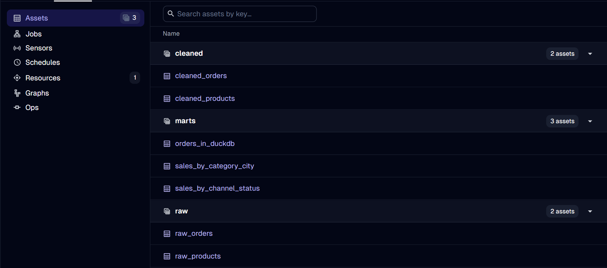
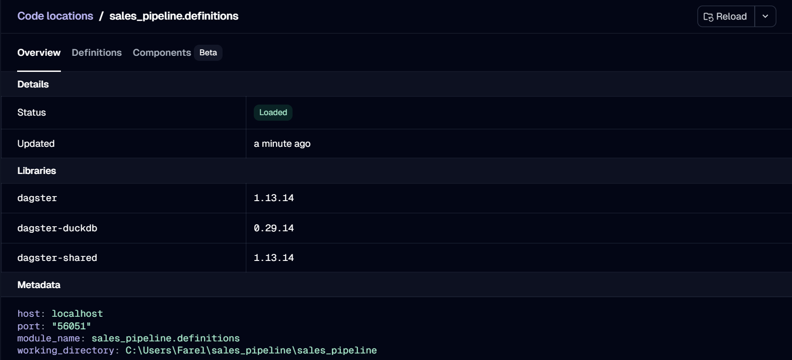

# Sales Pipeline — Dagster

An ETL pipeline for sales order data, orchestrated with [Dagster](https://dagster.io/). Raw sales data is extracted, cleaned, and transformed into analysis-ready assets, with the full pipeline visible and runnable through the Dagster UI.

## Table of Contents

1. [Overview](#1-overview)
2. [Tech Stack](#2-tech-stack)
3. [Project Structure](#3-project-structure)
4. [Data Flow](#4-data-flow)
5. [Getting Started](#5-getting-started)
6. [Screenshots](#6-screenshots)

## 1. Overview

This project implements a sales data pipeline using Dagster's asset-based orchestration framework. Each stage of the ETL process — raw ingestion, cleaning, and mart-level aggregation — is modeled as a Dagster asset, with dependencies tracked automatically and visible in the asset lineage graph.

## 2. Tech Stack

- **Orchestration:** Dagster
- **Language:** Python

## 3. Project Structure

```
sales-pipeline-dagster/
├── data/
├── sales_pipeline/
├── screenshot/
│   ├── dagster_assets_list.png
│   ├── dagster_asset_lineage.png
│   ├── dagster_run_success.png
│   ├── dagster_runs_list.png
│   └── dagster_code_location.png
├── .gitignore
└── README.md
```

## 4. Data Flow

Raw sales data → Extraction → Cleaning/Transformation → Aggregated marts. Each stage is represented as a Dagster asset, with dependencies visible in the global asset lineage graph.

## 5. Getting Started

1. Clone the repository
   ```bash
   git clone https://github.com/Euijoo097/sales-pipeline-dagster.git
   cd sales-pipeline-dagster
   ```
2. Install dependencies
   ```bash
   pip install -r requirements.txt
   ```
3. Launch the Dagster UI
   ```bash
   dagster dev
   ```
   Then navigate to `http://localhost:3000` to view assets and trigger runs.

## 6. Screenshots

### 1. Assets Grouped by Layer (Dagster UI)


### 2. Global Asset Lineage Graph (Dagster UI)


### 3. Successful Run Detail (Dagster UI)


### 4. Runs List (Dagster UI)


### 5. Code Location Overview (Dagster UI)


## Author

**Alifia Chika Intan (Nevie)**
[LinkedIn](https://linkedin.com/in/alifia-chika-intan-880b94202)
